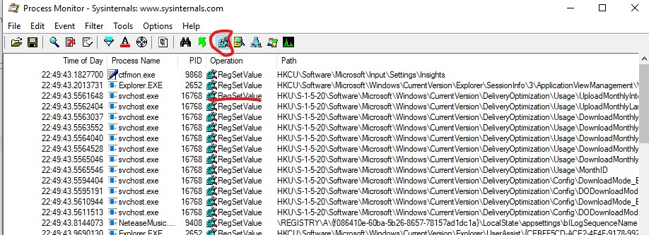

# 是谁在重置 Windows 的 DNS Server

## 起因

由于`http://cn.bing.com`临时不好用，原因是 DNS，于是强制指定自己`Widnows`系统 DNS 到`1.1.1.1`.但是发现，自己系统会自动重置 DNS。引起自己好奇，于是想查清楚到底是哪个 process 自动重置系统的 DNS。

## 查找问题的过程

- 强制指定路由器的 DNS Server,但是系统还是会重置 DNS Server.
- 检查 registry 后,DNS registry 会自动改变。

## 工具

于是使用微软的[Process Monitor](https://docs.microsoft.com/zh-cn/sysinternals/downloads/procmon),来检查是谁在变动 Registry?
找到 process 后，发现是 netsh 一直在 RegsetValue，更改 DNS 的 registry。于是我用`netsh int ip reset` 重置设置。问题解决！至于为什么 netsh 会重置 DNS server，**可能**是由于[Service Fabric](https://azure.microsoft.com/en-us/services/service-fabric/)的 Naming Server 的原因。

## 感悟

发现问题，不放弃，稳住一步步分析，就可以解决。不慌的代价就是凌晨一点后才睡。
