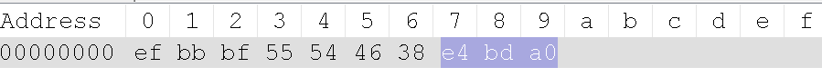

# 从存储字节理解 Unicode（UTF8/UTF16)

如果你不知道或者不了解什么是 Unicode/UTF8/UTF16，请详细阅读这篇文章（这也是这篇博文的先决条件）：
学点编码知识又不会死：Unicode 的流言终结者和编码大揭秘
<http://www.freebuf.com/articles/web/25623.html>

但是如果你看完以上文章后，疑惑为什么一个 Unicode:0x4F60（对应汉字是“你”）会在 UTF8 下占用 3 个字节的存储空间。
按照排列组合 2 个字节完全可以存储多数 unicode 字符，明显字符“你”（0x4F60）是在 2 个字节最大可能范围内（0xFFFF）。
但是为什么 UTF8 却使用 3 个字节存储字符“你”呢？这样不是明显浪费存储空间吗？

答案不仅是 UTF8 没有浪费存储空间，而且 UTF8 还是一个精美的设计，至少在我看来。

## Unicode/UTF8/UTF32

虽然你或许可能知道什么 UTF8，但是我还是要简单介绍下什么是 UTF8？什么是 UTF16？什么是 unicode？

看完我开头推荐的那篇详细的博文（学点编码知识又不会死：Unicode 的流言终结者和编码大揭秘）。你应该知道 unicode 是一种索引表，它规定了任何字符的 code。比如：字符“你”就是 0x4F60,在整个宇宙（你确定是整个宇宙？）的任何地方，只要你用的是 unicode，那么“你”的 unicode 就是“0x4F60”。

所以 Unicode 并不关心世界上有多少字符，如果你想把一个字符放入 Unicode 中，那么请告诉我你要放的是什么字符？那么 Unicode 会给你个索引号码？比如：汉字“你”就是“0x4F60”。也就是假如有一天人类统一了“三体星人”（可惜的是三体星已经被摧毁了。。），我们也可以把三体星文加入到 Unicode 中。

当然 Unicode 同样不关心你怎么实现，你怎么把字符编码成字节？所以 unicode 并不知道字符“你”占用几个字节。这时候就是 UTF(Unicode Transformation Formats)来规定 unicode 字符该如何存储，占用几个字节？

总而言之：
Unicode 定义世界每个字符的索引值。
UTF8/UTF16 实现 Unicode 的标准，把字符存储到存储介质中。

## 从字节角度看 UTF8

我们知道存储字节多少只和 UTF 有关，那么我们先看 UTF8 一张表.详情请查看 wikipedia 的介绍 https://en.wikipedia.org/wiki/UTF-8 。当然你看百度百科也是可以的。

```plain
Bits of First Last Bytes in Byte 1 Byte 2 Byte 3 Byte 4 Byte 5 Byte 6
code point code point code point sequence
  7 U+0000 U+007F 1 0xxxxxxx
11 U+0080 U+07FF 2 110xxxxx 10xxxxxx
16 U+0800 U+FFFF 3 1110xxxx 10xxxxxx 10xxxxxx
21 U+10000 U+1FFFFF 4 11110xxx 10xxxxxx 10xxxxxx 10xxxxxx
26 U+200000 U+3FFFFFF 5 111110xx 10xxxxxx 10xxxxxx 10xxxxxx 10xxxxxx
31 U+4000000 U+7FFFFFFF 6 1111110x 10xxxxxx 10xxxxxx 10xxxxxx 10xxxxxx 10xxxxxx
```

根据这张表，我们可以知道 0x4F60（字符“你”）是在范围（0x0800-0xFFFF），所以在 UF8 下需要 3 个字节来存储。

下面让例子来阐述为什么需要 3 个字节？首先，先看下这 3 个字节存放的是什么？
在 windows 新建一个 txt，写入字符“UTF8 你”（加入 UTF8 是为了有个基准线查看“你”的真实字节值），然后另存为 UTF8 编码。用 notepad++（需要装 HEX-editor 插件）或者 Binary Viewer，查看“你”在 UTF8 下的 16 进制值。



我们知道字符“UTF8”16 进制就是他们的 ASNI 码“0x55,0x54,0x46,0x38”.那么字符“你”在 UTF8 下 3 个字节的值是“0xE4/0xBD/0xA0”.

"0xE4"-->"11100100".
"0xBD"-->"10111101".
"0xA0"-->"10100000".
查看 UTF8 的表，给出每个字节 的前几个固定的二进制数。
“1110xxxx 10xxxxxx 10xxxxxx”对于到字符“你”就是“11100100 /10111101/ 10100000”。
拿出红色标注的部分“0100 111101 100000”，转换成 16 进制就是“0x4F60”也就对应的是 Unicode 字符“你”。

现在我们可以知道 UTF8 固定每个字节的前面几位二进制值，然后用其他的位来表示字符。但是为什么 UTF8 的设计者们要这样设计呢？

我想这是 UTF8 为了兼容 ASNI 所要付出的代价，请查看上表，UTF8 下是完全兼容 asni，也就是 asni 标准的下的文档，在 UTF8 下显示完全不是问题（因为 ASNI 存储字节值和 UTF8 是一样的）。字符都是一个一个字节存储的，UTF8 肯定是一个一个字节的读取，那么 UTF8 怎么在完全兼容 ASNI 前提下，知道某个字符是需要额外字节信息的？UTF8 只有固定前几位二进制来决定这个字符需要以后的几个字节，又因为为了兼容 ASNI，所以额外字节也需要固定前 2 位“10xxxxxx”，来决定这个字节值不是代表 ASNI 字符。

另外，你也完全可以自己实现一个标准来解释 Unicode，比如就叫做 UTF9 吧，只要你能完全解释 Unicode。
实际上是有 UTF7,UTF8,UTF16,UTF32 的。

## 从字节角度看 UTF16

同样的，我们把 txt:“UTF8 你”另存为 UTF16 编码（windows 下 unicode 编码就是指 UTF16）。


UTF16 下的每个字符需要是 2 个或者 4 个字节。
字符“UTF8”在 UTF16 下就是“0x55/0x0054/0x0045/0x0038”,那为什么图片中是 0x5500 呢？这涉及到高字节序和低字节序。开头的那篇文章也有介绍。字节序仅仅就是先把字符的高位或者低位先放入存储的而已。 1. 高字节序，高位字节被存在前面 2. 低字节序，低位字节被存在前面

比如字符“你”“0x4F60”，第一个字节是“4F”是“高位”，第二个字节是“60”是“低位”.
稍微解释下为什么左边是高位，玩笑话就是想想你的银行账户当然是左面数值多才有意义啊。
那么按照“低字节序” “0x4F60”就被存储为“60 4F”拉。在 intel CPU 下默认是“低字节序”。

在 UTF16 下，存储的字节值和 unicode 是一一对应的。但是 UTF16 显示英文（asni）就浪费一个字节。所以英文国家用 UTF8 的编码比较多。反之其他国家用 UTF16 的较多。

## 字节顺序标记(BOM)

不知道你有没有注意到，在 UTF16 下的这张图，地址第 0，第 1 位是“FF FE”


这就是 BOM，通过 FF FE 或者 FE FF 来告诉解释器是那种字节序。
那么你也许会问，为什么 UTF8 没有字节序呢？那是因为 UTF8 是以字节为单位，一个一个字节读取。UTF16 是以字为单位，一个一个字符（2 个字节或者 4 个字节）读取，这样就会涉及先读取第一个或者第二个字节的情况。

希望这篇文章从存储字节角度看 UTF8 和 UTF16 会为给你带来不一样的感觉。
