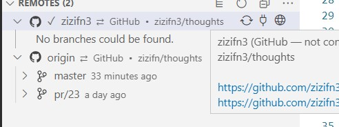

# 一份给自己用的 GIT 教程

首先这是一份给自己用的 GIT 教程。对于如何学习， 当然是要多刷几遍 [learngitbranching](http://learngitbranching.js.org/?demo) ， 和常用 `git help` 或者 https://git-scm.com/docs/user-manual

上面三个是第一应该查看的。那么这边教程是干什么的呢？是记录我在学习中实践的记录

## git pull && git fetch

`it pull is shorthand for git fetch followed by git merge FETCH_HEAD. `

当我们理解这个时候，一定要理解本地 branch 和 remote branch 的区别。 可以借助 `git branch -r` 来加以理解。
如果想指定 remote，这个时候就需要 `git remote -v` 查看。 一般默认 remote 会有个本地名字 `origin` (可以改)。 然后辅助 online 文档，基本没有问题。

## git push

没什么好说的。当然也是可以明确指定 remote 的。`git push -u`

## git commit

这个有什么好说的呢。

## git branch

这个有什么好说的呢。多敲几下命令，`git branch -h`

## git switch / checkout

## git merge

## git rebase

- fast forward

个人建议用 `rebase` 外加 `merge` 时候 fast forward， 这样可以保证 commit history 线条统一。当然这完全是个人喜好。

## git remote

- 通过再加一个 remote 这样就可以很简单的做两个源直接的同步。比如大家经常看到的镜像 repo

- 或者 Github 的 Fork 以及 Fork 之间的 Pull Request
  如果忘记了，记得去把一个 PR clone 到本地，然后再 remote 里面就会看到。

仔细看下面的图，然后回答下面几个问题

1. 这是几个本地仓库？
2. 为什么一个本地仓库可以有多个 remote？
3. 可不可以 `merge/reabse` zizifn3 到 origin？
4. 怎么操作？
   当然是界面操作了，其实 `pull/ push` etc 都是可以显示指定 remote 的。

   
