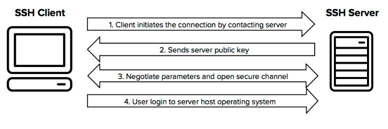
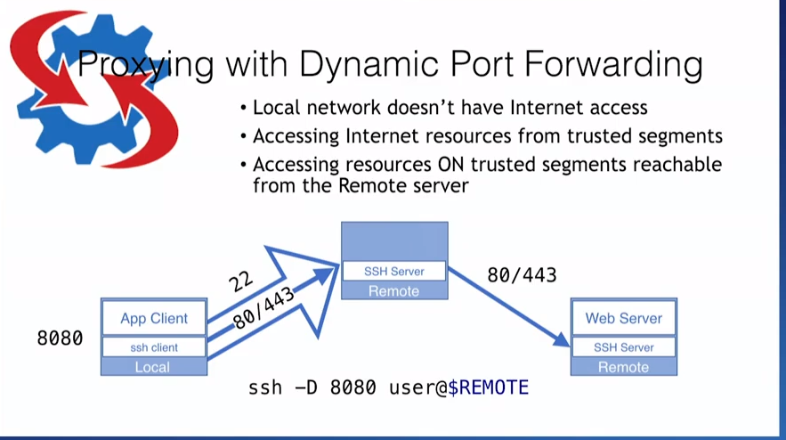
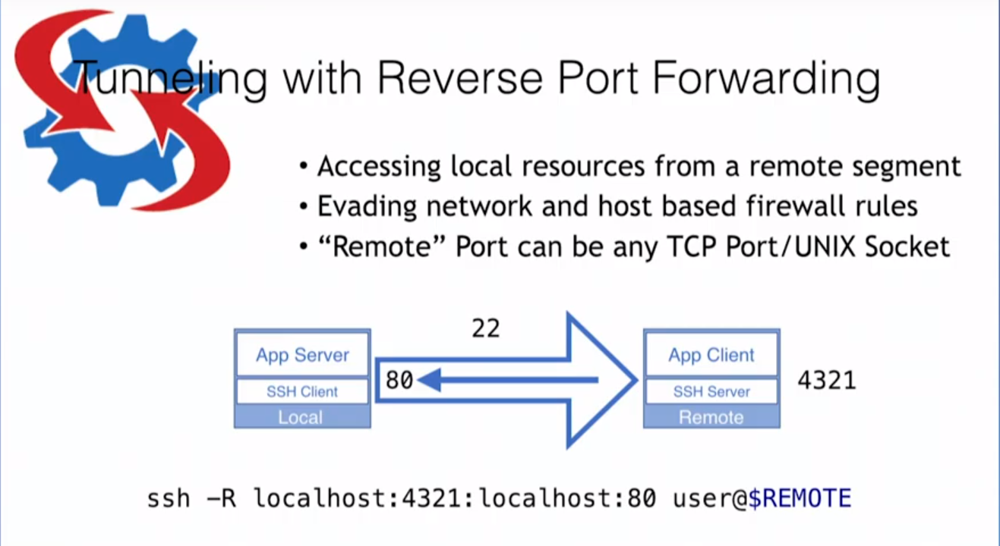
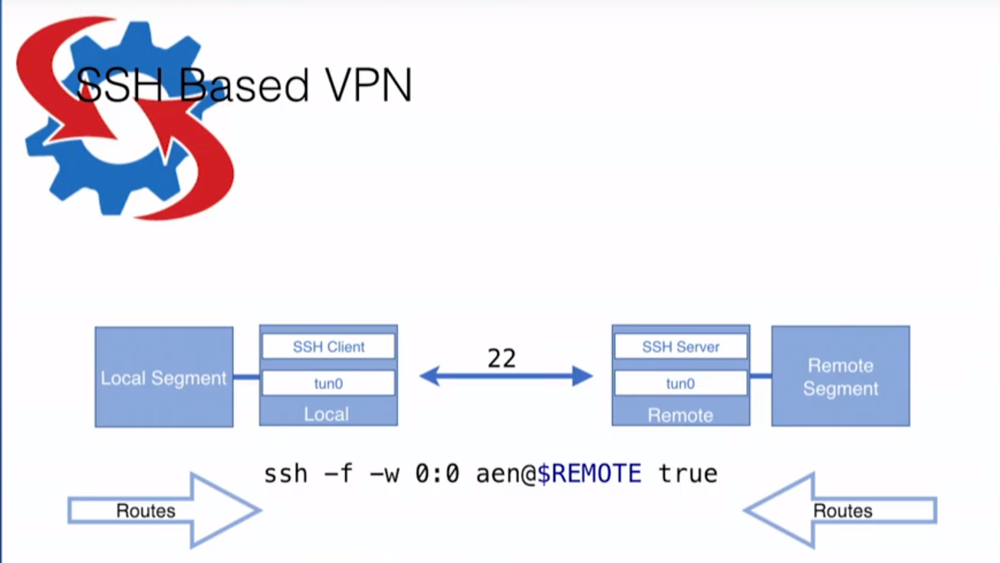

# SSH

随着 Windows10 集成了Open ssh. SSH的简单总结有必要来一下。

## Why we need SSH?

- [TTY](https://en.wikipedia.org/wiki/Tty_(unix))?
[Teleprinter](https://en.wikipedia.org/wiki/Teleprinter)
[The TTY demystified](http://www.linusakesson.net/programming/tty/index.php)
- [Docker command example](https://docs.docker.com/v17.12/edge/engine/reference/commandline/container_exec/#description)

    `--tty , -t	Allocate a pseudo-TTY`
- How to remote?
SSH?
- SSH without tty
`ssh host_test ls`

## How SSH work?



## Authentications

```
PasswordAuthentication yes
PubkeyAuthentication yes
```

### PasswordAuthentication

Nothing to say.

### PubkeyAuthentication

Need do something in server.

### SSH client config for multiple Pubkey

```
# Company account
Host company
HostName github.com
PreferredAuthentications publickey
IdentityFile ~/.ssh/id_rsa_company

# Personal account
Host personal
HostName github.com
PreferredAuthentications publickey
IdentityFile ~/.ssh/id_rsa_personal
```

## Proxying with Dynamic Port Forwarding



- Why need this?
- Sample

## Tunneling with Local Port Forwarding


- Why need this?
- Sample

## Tunneling with Reverse Port Forwarding



- Why need this?

## SSH Based Multi-hop Jump Hosts


- Why need this?

## SSH Based VPN



- Why need this?

## 引用

[Firewall Evasion and Remote Access with OpenSSH by Anthony Nocentino](https://www.youtube.com/watch?v=7gzA240k7OE)

[OpenSSH Internals for PowerShell Pros by Anthony Nocentino](https://www.youtube.com/watch?v=CPE2-bWK9Vc)

Or if you can't accesss youtube,

https://www.bilibili.com/video/av52884427/