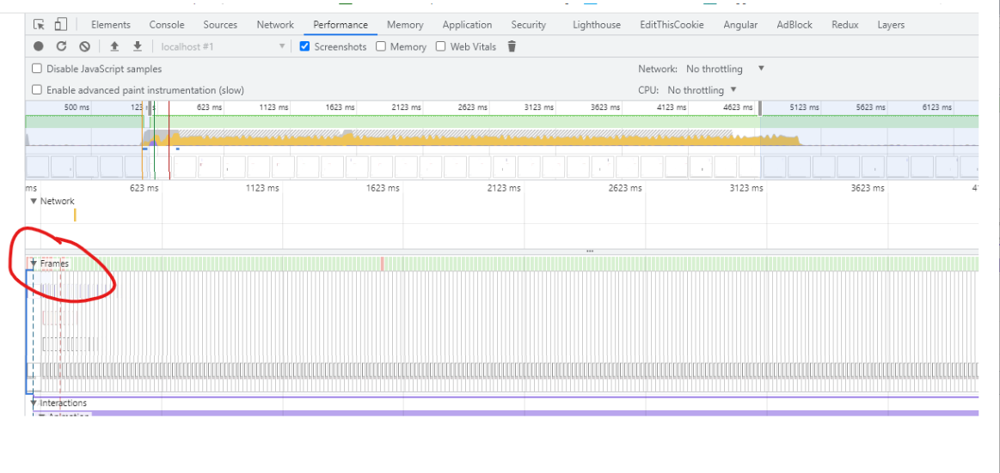
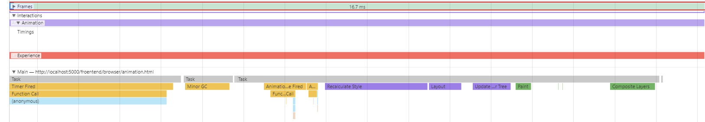
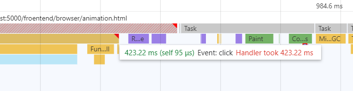
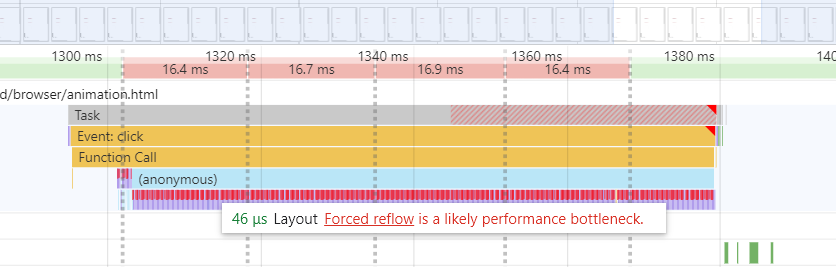

# 前端性能优化--Use Tools Not Rule

我始终认为过早优化是不对的，我们在些前端 code 时候，只需要有个大局观，没有必要扣各种细节。过早的使用各种 提高 Performance 的建议不可取。比如下面的例子，

```javascript
const el = document.getElementById("test");
el.style.padding = "5px";
el.style.borderLeft = "1px";
el.style.borderRight = "2px";
```

> 这个例子，在现代浏览器下，都不会引起超过一次的回流。

如果我们遇到问题，我们应该使用 工具 而不是记住各种 rule， 因为浏览器在变化，之前的最佳实践到现在不一定是对的。

> 比如，大家流传很广的 CSS DOM，其实 Chrome 很早之前就已经不在使用了，而是再用 style calculate。理论(chrome)都在变，根据这个理论延申的规则也是不对的。
> Chrome 等浏览器都在不断进步！！请相信浏览器的工程师。

## 什么是性能问题

如果我们网页可以稳定在 FPS 是 60，任何响应都可以在 100ms 内有反馈，就不需要优化！！那么怎么才能知道自己网站是否在 60fps 呢？

### Chrome Dev Tool 的 Performance 工具

注意看下面，每一帧（16.6ms）都在，都是绿色的。如果很多红色的，代表那一帧丢失。



### 正常帧都有些什么？

正常帧在 16.7ms 内一般会执行下面的内容，而且执行时间一般很短。

- 宏任务的执行，比如 click 的事件（如果有）
- requestAnimationFrame 的 callback（如果有）
- Recalculate Style （如果有必要）
- Update Layer Tree （如果需要）
- Composite Layers （如果需要）
- Paint （如果需要）



### 不正常帧都有些什么？

不正常帧的就是在 16.7ms 执行不完上面的步骤。着一些都在浏览器工具中有体现。

#### 比如宏任务的执行时间长

如果我们 JavaScript 使用了过多的计算，就会导致主线程被占用，无法在 16.7ms 完成所有不揍。在 Chrome 下，我们可以清楚的找到执行时间过长的 JavaScript。

如果 JavaScript 过长不仅仅会影响渲染，还会影响其他宏任务的执行。


#### Recalculate Style（回流） 次数过多或者过长

Recalculate Style（回流）此时过多或者过长，也会让帧的时间过长。从而影响流畅度和其他宏任务的运行。



### Recalculate Style（回流） and Paint（重绘）不可怕

Recalculate Style（回流） and Paint（重绘）是无法避免的，也不可怕。只要他们都能在一个正常帧（16.7ms）内完成是没有任何问题的。

### 使用工具而不是规则。Use Tools not rule

因为浏览器在变，然而推荐的性能改进点却很少更新。
所以忘掉细节的规则，如果感觉自己界面卡，请使用浏览器的 Performance 工具，很容易看到到底是什么占用过多的时间。然后再去想办法。

如果过早使用提高性能规则，等到浏览器更新了，也不会有人去更新 code 的。代码也会逐渐变的不可维护。

所以只在性能有问题的时候，才去优化性能，**不要过早使用提高性能规则。**

> 请善用工具，忘掉八股文。也许这样对自己网站更好。
> 不同网站都性能的要求不一样，请根据自己业务需求而定。

> reference
> [What forces layout / reflow](https://gist.github.com/paulirish/5d52fb081b3570c81e3a)
