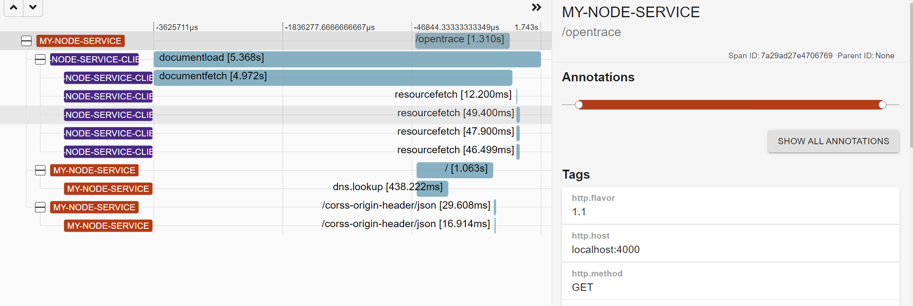

# 全链路追踪的实现原理 - 简易版

在微服务的今天，全链路追踪似乎成为了标配。特别是 open tracing 和 opencensus 合并成为 [opentelemetry](https://opentelemetry.io/) ，一个标准正在形成。但是全链路追踪的原理是什么？

> 所有需要**注入**到业务代码的全链路追踪都是耍流氓。

## open telemetry

这里我只拿 http 作为例子，其实其他也是一样。opentelemetry 的原理就是，它无侵入的把 `{version}-{traceId}-{spanId}-{sampleDecision}` (00-cc8516a5aaea87046a666c18ad82fada-7a29ad27e4706769-01) 这样的字符串注入到 HTTP header 中,这样就可以做到全链路的追踪，通过 traceid 就可以把各种 http 关联起来。

然后借用工具，可以方便的展示整个链路的追踪。



**但是 opentelemetry 是怎么无侵入性追踪 http 的呢？**

这里我们分为，node 段和浏览器端。

## Node.js

### 拦截 http/https 模块

#### 原理

``` js
import https from 'https';

//原理代码， 可以把下面代码抽象到一个 module 中，然后实现无痛注入
const orginRequest = https.request;
https.request = function () {
    console.log('interceptor');
    // 这里可以做的事情很多，
    // 1. 修改 http header， 注入全链路追踪的id
    // 2. 修改 request callback
    return Reflect.apply(orginRequest, this, arguments)
}
const options = {
    hostname: 'www.baidu.com',
    port: 443,
    path: "/img/PC_7ac6a6d319ba4ae29b38e5e4280e9122.png",
    method: 'GET'
}
const req = https.request(options, res => {
    console.log(`statusCode: ${res.statusCode}`)
})
req.end();
```

成熟的实现是有点复杂的，需要考虑哪些包需要 [monkey patch](https://zh.wikipedia.org/wiki/%E7%8C%B4%E8%A1%A5%E4%B8%81). 还需要在 `import` 阶段替换方法。

#### 成熟实现

[opentelemetry-instrumentation-http](https://github.com/open-telemetry/opentelemetry-js/tree/main/experimental/packages/opentelemetry-instrumentation-http)

其实 opentelemetry-instrumentation-http 是背后使用了，

1. [require-in-the-middle](https://www.npmjs.com/package/require-in-the-middle)

这个 package 负责，import 时候替换 module。

2. [shimmer](https://www.npmjs.com/package/shimmer)

shimmer 负责在替换 module 时候替换具体方法的实现。

## 浏览器

首先需要在 index 界面加入一个 `<meta name="traceparent" content="{version}-{traceId}-{spanId}-{sampleDecision}">`, 这里需要 server 生成相关的 id。然后在之后，注入到网页上的 http 请求的 header 中。

### 拦截 http

实现原理很简单，就是 [monkey patch](https://zh.wikipedia.org/wiki/%E7%8C%B4%E8%A1%A5%E4%B8%81).

``` js
const origin = fetch;
window.fetch = function fn(...args) {
    console.log('inside fetch');
    const url = args[0];
    let opt = args[1] || {};
    // 注入 traceparent header
    opt.headers = { ...opt.headers, 'traceparent': 'test12' };
    const newArgs = [url, opt];
    return Reflect.apply(origin, window, newArgs);
}
btn1.addEventListener('click', async () => {
    console.log("callback....");
    const resp = await fetch("http://localhost:5000/froentend/zonejs/zonejs.html")
    const text = await resp.text();
    console.log(text);
});
```

#### 成熟实现

1. [opentelemetry-instrumentation-xml-http-request](https://github.com/open-telemetry/opentelemetry-js/tree/main/experimental/packages/opentelemetry-instrumentation-xml-http-request)

2. [opentelemetry-instrumentation-fetch](https://github.com/open-telemetry/opentelemetry-js/tree/main/experimental/packages/opentelemetry-instrumentation-fetch)

但是如果是用户的点击，`click` 事件，我们怎么 trace 呢？

### 监控用户行为

一样，使用 [monkey patch](https://zh.wikipedia.org/wiki/%E7%8C%B4%E8%A1%A5%E4%B8%81)。

```js
function timeUp(fn) {
    const start = performance.now();
    return function (event) {
        const result = Reflect.apply(fn, this, arguments);
        const end = performance.now();
        console.log("time up is ", end - start, performance.now());
        return result;
    }
}

btn1.addEventListener('click', timeUp(() => {
    let result = 0;
    for (let index = 0; index < 10000; index++) {
        result += index;
    }
    console.log(result, performance.now());
}));

```

然后把搜集到的数据，发送到全链路 logging 的服务器上。

但是这里仅仅是同步任务，如果 callback 又异步任务， setTimeout/Promise， 那么统计这些的所耗费的时间，就变得很困难。还好，使用 zone.js 就可以轻松的解决这些问题。

#### 成熟的实现

[opentelemetry-instrumentation-user-interaction](https://github.com/open-telemetry/opentelemetry-js-contrib/tree/main/plugins/web/opentelemetry-instrumentation-user-interaction)

### 搜集 Web Vitals

#### Largest Contentful Paint (LCP)

#### First Input Delay (FID)

#### Cumulative Layout Shift (CLS)
