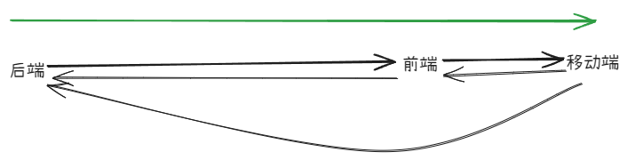

# 如何工程的效率？-- 好的团队文化

> 草稿，没有全部完成

好的工程师无论是前端，后端，mobile，如果遇到一个问题，他们喜欢去查找解决问题。无论这个问题是在那一端？

那么好的文化是，尽量让这些工程师去解决问题。但是实际中，不同的组会设置不同的 rule，让来自不同的组的工程师解决问题很是艰难。

比如，一个前端工程师要去解决一个 mobile 问题，mobile 组一般会设置一个 code 标准。更有甚者，让你参加一个几个月的培训，这样才能解决问题。

这样的文化，会让哪些像解决问题的工程师失望。因为他们想看到问题被解决，而在乎这个问题在哪一端。

## 如何解决

1. 降低技术的门槛。

好的技术可以让不同端的工程师，更不容易去畏惧。

2. 更自由的文化。

更自由的文化，让工程师没有太大的心理负担。
