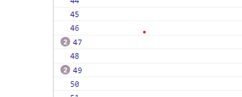

# 怎么在前端做个完美的计时器？

在讨论怎么怎么做计时器之前，我们先看计时器要满足什么功能,

- [✅] 能准确的计时
- [✅] 能够稳定的更新 UI
- [✅] 不要浪费资源

## setTimeout/ setInterval

计时器，谁不会啊？最基础的 js 方法`setInterval`.

```javascript
function timer1() {
  let seconds = 1;

  setInterval(() => {
    updateUI(seconds++);
  }, 1000);
}
timer1();
```

Job done! 下班！等等！ 让我们看看计时器的需求，

- [❌ ] 能精准的计时 (**不能满足这个需求，下面解释**)
- [✅] 能够稳定的更新 UI (**绝大部分情况能更新 UI， 这个满足**)
- [✅] 不要浪费资源 (**一秒运行一次，没有浪费资源的**)

这个计时器为什么不能精准计时？让我们看下，[MDN setInterval](https://developer.mozilla.org/zh-CN/docs/Web/API/setInterval) 的说明，

```text
delay
......和setTimeout一样，实际的延迟时间可能会稍长一点。
```

哦! `和setTimeout一样，实际的延迟时间可能会稍长一点。`, 这意味着每一次或许都有几毫秒的延迟，积少成多，几千秒会有一秒延迟。
一个不能准确计时的~计时器~。 是没有用的。

> 不同浏览器延迟不一样。


# 改进版 setInterval

既然 `setInterval`的 delay 不能精确计时，我们可以自己使用`Date.now()`,然后自己算出已经过去了多少秒，这样就能精确的计时。只让`setInterval`去更新 UI。

```js
function timer1() {
  let start = Date.now();
  setInterval(() => {
    let gaps = Date.now() - start;
    let seconds = Math.floor(gaps / 1000);
    updateUI(seconds);
  }, 1000);
}

timer1();
```

Job done! 下班！等等！ 让我们看看我们的需求，

- [✅] 能精准的计时 （**满足，因为我们自己计时**）
- [❌ ] 能够稳定的更新 UI （ **绝大部分情况能稳定的更新 UI，但是有时候会跳数。**）
- [✅] 不要浪费资源 （**一秒运行一次，没有浪费资源的**）

为什么有时候会跳数呢？因为`setInterval`每执行一次 callback 都有几毫秒的延迟，这就会导致，我们计时器 UI 会每一段时间都会跳数。比如突然从 255 跳到 257.

虽然跳数，但是只是 UI 显示，最起码解决了上个方案，计时器不能精确计时的问题。

问题不大，但是有点问题！怎么办呢？ 有没有更新 UI 更频繁的方式呢？

> 如果我们把 setInterval 设置成 900ms 不就完全没有问题了吗？也可以，但是如果你想要每 100ms 更新一次 UI 呢？

## requestAnimationFrame (RAF)

[MDN requestAnimationFrame](https://developer.mozilla.org/zh-CN/docs/Web/API/window/requestAnimationFrame)

```text
告诉浏览器——你希望执行一个动画，并且要求浏览器在下次重绘之前调用指定的回调函数更新动画。

注意：若你想在浏览器下次重绘之前继续更新下一帧动画，那么回调函数自身必须再次调用window.requestAnimationFrame()

当你准备更新动画时你应该调用此方法。这将使浏览器在下一次重绘之前调用你传入给该方法的动画函数(即你的回调函数)。回调函数执行次数通常是每秒60次，但在大多数遵循W3C建议的浏览器中，回调函数执行次数通常与浏览器屏幕刷新次数相匹配。
```

哦，重绘之前调用，甚至可以每秒 60 次，和刷新率一样，看起来不错，可以解决 UI 延迟更新的问题。
与此同时我们 UI 的更新的精确度，来到了 16.67ms。

```js
let start = Date.now();
function timer1() {
  let gaps = Date.now() - start;
  let seconds = Math.floor(gaps / 1000);
  updateUI(seconds);
  requestAnimationFrame(timer1);
}
timer1();
```

Job done! 下班！等等！ 让我们看看我们的需求，

- [✅] 能精准的计时
- [✅] 能够稳定的更新 UI
- [ ❌] 不要浪费资源 （**不满足**）

这个方式浪费资源，为什么呢，让我们再看下 MDN 的说明，

```text
为了提高性能和电池寿命，因此在大多数浏览器里，当requestAnimationFrame() 运行在后台标签页或者隐藏的<iframe> 里时，requestAnimationFrame() 会被暂停调用以提升性能和电池寿命。
```

哦，因为每秒调用 60 次，然后更新 dom，但是我们计时器是 1 秒更新一次 UI，这就意味着浪费了 59 次。会浪费多余电力，不环保啊。

怎么解决呢？可不可以不让 `requestAnimationFrame` 不 60 秒调用一次呢？对你想的没错，`setTimeout`.

## setTimeout / requestAnimationFrame (RAF)

我们可以在`requestAnimationFrame` callback 里面不直接调用`requestAnimationFrame`，而是用`setTimeout` 自己调度。

但是`setTimeout` delay 应该设置多少呢？我们必须保证每秒间隔内运行一次`requestAnimationFrame`。这就需要我们自己计算间隔。

```js
const start = document.timeline
  ? document.timeline.currentTime
  : performance.now(); // 取当前时间，这个时间是tab开启的时间

function timer1(time) {
  const gaps = time - start;
  const seconds = Math.round(gaps / 1000);
  updateUI(seconds);
  setTimeout(
    () => {
      requestAnimationFrame(timer1);
      //timer1(document.timeline.currentTime) //
    },
    1000 - (gaps % 1000) // 为了保证在每秒起点开始运行requestAnimationFrame
  );
}
timer1();
```

这里还是不够好，因为有些情况会出现`setTimeout` 执行两次的情况。



## 完美版本

```js
function interval(ms, callback) {
  const start = document.timeline
    ? document.timeline.currentTime
    : performance.now();
  function timer1(time) {
    const gaps = time - start;
    const seconds = Math.round(gaps / ms);
    callback(seconds);
    console.log(seconds);
    const targetNext = (seconds + 1) * ms + start; // 算出下次interval开始的时间
    const delay = document.timeline
      ? document.timeline.currentTime
      : performance.now(); // 取出更新完UI的时间
    setTimeout(
      () => {
        requestAnimationFrame(timer1);
      },
      targetNext - delay // 算出距离下次interval开始时间
    );
  }
  timer1(start);
}

interval(1000, updateUI);
```

> reference
> <https://www.youtube.com/watch?v=MCi6AZMkxcU>
