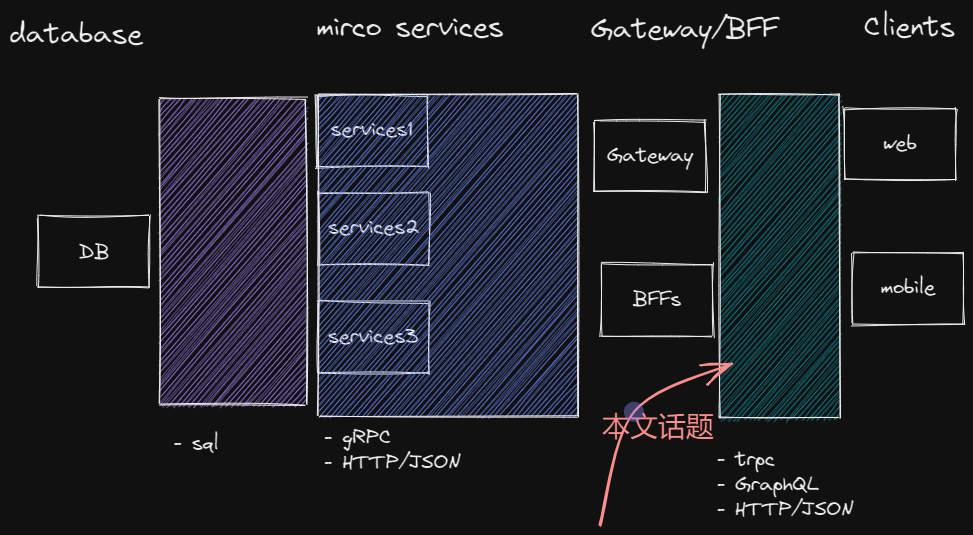
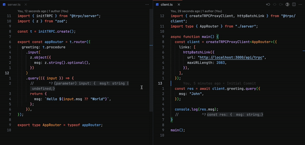
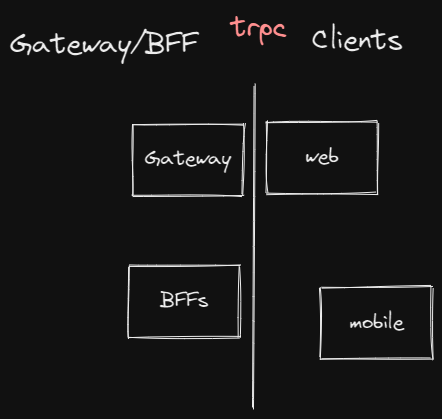
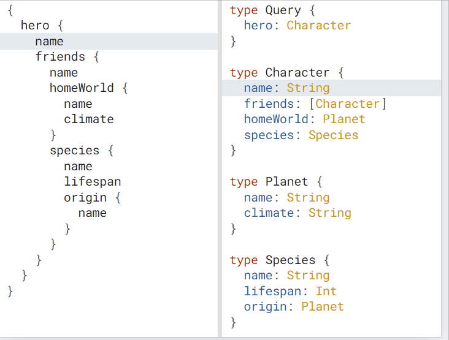
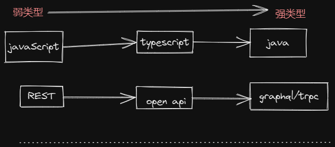

# 如何让前后端高效的合作？

> Any problem in computer science can be solved with another layer of indirection[1](https://en.wikipedia.org/wiki/Fundamental_theorem_of_software_engineering)
> ——David Wheeler

相信大家都听过上面一句计算机问题的名言， “任何计算机问题均可通过增加一个间接（indirection）层来解决“。

现在的软件开发被分成了很多层，DB，后端，前端。那么每层和每层都有自己独特交流方式。

本文把问题聚焦在，前后端交流上，如果要问，前后端交流什么最烦？

1. 那么估计就是后端 API 接口的 request/response 的定义会排在第一位。
2. 第二位或许就是前端的 API 类型的定义，并且保持 API 类型 和 server 是一致的。

如果能完美的解决这个两个问题，那么前后端开发者，估计都很开心，再也不用一起撕逼了。

本文，我讲分别阐述，目前最流行的三种解决方案优缺点。

## 魔法一般的 TRPC

> 请不要把 TRPC 和 GRPC 混为一谈，他们可以说毫不相干。

如果你的项目恰好是 full stack 项目，前后端在一起，比如 Next.js 或者 express.js + angular/vue/react。 并且你们使用 typescript，那么 TRPC 是非常值得你考虑的产品。

上图的 client 没有导入任何 server 端的 code，仅仅是导入 type。

注意看，这里 server 定义的任何 type 基本是不需要特别的 model 的，然后 client 都可以无痛的拿到。

Client 甚至感觉不到自己在发起 http 请求，就像调用一个方法一样。所有的参数和返回值都有自动有了 type。

如果你经常被后端 api 的结构坑，或者经常手写后端 api 的 model 定义，那么 trpc 就是提高效率，提前下班的技术。

更多例子请参考官网，https://trpc.io/。

TRPC 无需 code generator 就可以 前后端的接口是一直，并且它会让前后端的边界变得是非常模糊。

### 优点

1. 强 type
   TRPC 在编译器和运行时，如果传入的 type 不满足定义，都会直接报错。
2. 无需使用生成客户端类型

### 缺点

1. 必须是 typescript
2. 如果 mobile 采用原生的技术， 那么 trpc 使用起来很困难。
   不过 https://github.com/jlalmes/trpc-openapi 这个项目，可以把 trpc 的 API 生成 openapi/swagger，这样非 Typescript 的项目就可以使用了。

## 重新创建一门语言的 Graphql

GraphQL 创造了一本新的语言， 我们再写 GraphQL 时候，首先是先定义 利用 GQL schema。

GraphQL 通过 schema 的定义保证 server 端和客户端的类型是统一的。

### 优点

1. 强 type
   GraphQL 在编译器和运行时，如果传入的 type 不满足定义，都会直接报错。
2. 全平台支持

### 缺点

1. 是一门新的语言
2. 需要根据 schema 生成不同平台的代码

## 为什么基于 REST 的 OpenAPI 为什么不完美

等等，你们这圈乱造轮子的前端工程师。我 原生 REST 明明有 OpenAPI。请你 GraphQL 不要在重新发明 标准。

兄弟不要着急，你想一想，你是否遇到 OpenAPI 的描述和实际返回的不同。

虽然 OpenAPI 是标准，但是 实际不同的 REST 框架并不能 100% 保证每个字段的类型和实际 API 是一致的。并且 OpenAPI 中还可以定义 any 类型。

具体 某个 API OpenAPI/swagger 好不好，这个要看开发者的良心。

这样通过代码生成 client 端的 code，并不一定和实际的 api 保持一致。

但是对比 trpc 通过 server 和 client 使用同一份 类型，保证编译和运行，如果出现类型不匹配，直接报错。

Graphql 通过先定义 schema，然后通过代码生成不同平台的类型，保证编译和运行，如果出现类型不匹配，直接报错。

## 本质的区别

如果把没有任何标准的 REST API（这也是绝大多数 API 的现状）比喻成弱类型的话，那么 OpenAPI 仅仅是为 原生 REST API 加上了类型系统。而 Graphql/trpc 是完全的强类型。

