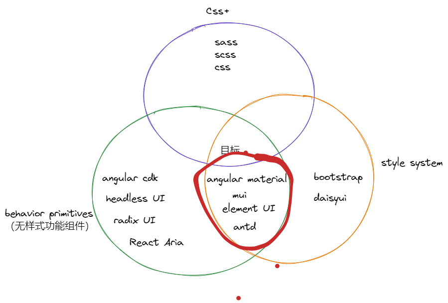
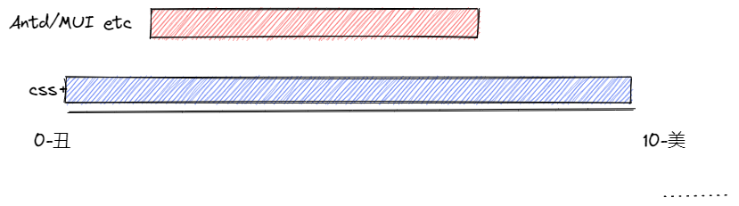

# 选择前端 UI library 的底层原理


作为前端，我们最重要的工作，就是为用户创建网页。为此我们有很多 UI library。但是这些 UI library 的关系是什么，我们该如何选择，选择的根据是什么？

## UI 组件的组成部分

在探讨不同 UI library 之前，我们先讨论下，UI 的三大基础组成部分。

### css+

CSS 虽然是 web 的基石，但是日常是很少直接使用。经常使用的是，CSS 增强 library， 比如 sass 等。但是无论无何这都是 UI 最重要的一环。

### 样式系统

每个 UI 都有一套自己的设计风格，不同网站不同风格，如果把这些风格抽象出来，就有了样式系统，其中最主要的代表例子就是 bootstrap。
有个组件系统，我们就不用直接写最原始的 CSS+， 而是直接使用定义好的，CSS class。

```html
<button type="button" class="btn btn-primary">Primary</button>
```

**样式系统，是定义 UI 长成什么样子。所谓的面子。**

### 行为组件

UI 仅仅有长的漂亮是不够的，UI 还需要动起来，还需要满足各种需求以及 accessibility，有些点击弹出一个窗口，有些是列表，可以选择。这些本地里都是需要 JavaScript 才能工作的。

其中 [headless UI](https://headlessui.com/), 就是一些，只有行为而没有任何样式的系统。

> 必须自己引入 css 或者复用其他以及定义好的 css。

> 其他的还有，angular cdk/radix UI/React Aria 等
```jsx
import { useState } from "react";
import { Dialog } from "@headlessui/react";

function MyDialog() {
  let [isOpen, setIsOpen] = useState(true);

  return (
    <Dialog
      open={isOpen}
      onClose={() => setIsOpen(false)}
      className="relative z-50"
    >
      <div className="fixed inset-0 flex items-center justify-center p-4">
        <Dialog.Panel className="w-full max-w-sm rounded bg-white">
          <Dialog.Title>Complete your order</Dialog.Title>

          {/* ... */}
        </Dialog.Panel>
      </div>
    </Dialog>
  );
}
```

上面例子中， headless UI 只负责，Dialog 组件的行为，点击弹出。 具体长什么样子，它不关系。

**行为组件，是定义 UI 如何工作的。所谓里子**

## Component library

不对了，这不是讨论，UI library， 我们日常使用的， `Ant Design`, `element ui`, `MUI`, `Angular material` 呢？

他们不过同时满足，`样式系统` 和 `行为组件` 罢了。



这些组件 library **强烈**的设计风格，并且他们组件也有完善的功能可以拿到就用。

## 我们的目标是什么

那么这是不是意味着，我们应该尽量使用 像 `Ant Design`, `element ui`, `MUI`, `Angular material` 这些组件 library 呢？

在回答这个问题前，我们先问下，构建 UI 的目的是什么？

如果我们的目标是，为用户快速提供一个人性的，美观的，符合公司设计的 UI。让我们按照这个目标来审视下，我们以上讨论的技术？



如果我们不使用这些组件 library， 我们可以构建出来任何的 UI，满足任何设计。 但是取决与实现和设计的好坏。

**是上线高，下线低的方案。**

如果我们使用了 `Ant Design`, `element ui`, `MUI`, `Angular material`， 那么你的设计风格就锁死他们的系统里面，如果未来想改动他的某些行为和样式是是非的困难的。

**是上线低，下线高的方案。**

## 应该怎么选择？

那么我们该如何选择，如果你公司没有自己独立的设计风格，也不太在乎自己的风格，那么像`Ant Design`, `element ui`, `MUI`, `Angular material` 就可以拿到就用。

如果不是，那么选择 `行为组件`(比如 headless UI etc) 和 `css+`, 在少量使用一些自己的设计样式。

## Tailwind css & Tailwind UI

最后让我们讨论下，想 [Tailwind css](https://tailwindcss.com/) 是属于 `css+` 还是 `样式系统` 呢？

那么来自 同一团队的 [Tailwind UI](https://tailwindui.com/?ref=top) 该如何归类的。


