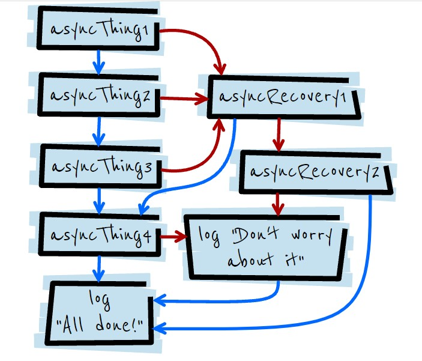

# 作为前端面试官的面试套路手册

由于最近大量面试人，总结了一套面试套路。个人认为 ~~或许/maybe/probably/perhaps~~ 能够选出 Lead 以下的人。

> 不过这一套下来，需要 2 个小时，需要根据面试者不同情况，删减或者忽略问题。

> ~~Lead 以上 level 我没有把握。Lead 以下，如果他过了，我有 70%的概率会满意他进来后工作的表现。~~

## HTML

- HTML 语义化
  我一般不会直接上来就问语义化这么明确的问题，我一般是让面试者，介绍最近实现的功能，然后引导出使用了什么标签？
  - 问题: 一般使用`div` 和 `span`就可以实现大部分功能，为什么 html 标准会有那么多标签？
- DOM 的基本操作
  - querySelector
    这里留个口子，引出 CSS 选择器。
  - createElement
  - appendChild / prepend
  - removeChild/ remove
    其实不是想问怎么操作 DOM，而是测试面试者是否知道，DOM 和 html markup 之间的关系?

> 你看看，作为面试官，明知道自己的问题不明确，需要别人再次确认，还是故意这样问。

> 但是，作为程序员，通过交流明确需求是一个技能。但是当别人答不上来，我会给引导，然后会明确需求的。

- 题目
  这个代码考验，怎么实现 dom 操作？
  [Code](./dom.html)
  

## CSS

- 选择器

  - Type/id/class/attribute

- 组合选择器

  - Selector list (span,div)
  - Descendant combinator (span div)
  - Child combinator (span > div)
  - General sibling combinator (span ~ div)
  - Adjacent sibling combinator (span + div)
    > 这里不是让面试者，背 css selector， 是通过问题和回答，让自己对面试者有个感觉。但是感觉这个东西就很神奇和诡异了。:(

- 伪类和伪元素

  - 什么是伪类，什么是伪元素?
    如果面试者没有答上来，用`:hover`（状态） 和`::before`（element）作为引导，让他对比差别？

- 选择的权重

  - id > class/attribute/pseudo > type
  - 怎么看 !important，怎么 override。

- 布局 flexbox
  这里重点不是靠属性怎么写？而是看面试者有没有在全局上了解 flex。
- 布局 Grid
  我一般不问。
- ~~这里插入 BFC/IFC~~
  > 我没有想好怎么问这一类问题？ 我不想让面试者背定义，等我想好一个好的代码例子~~

### refer

[CSS_Selectors](https://developer.mozilla.org/en-US/docs/Web/CSS/CSS_Selectors)

## JavaScript

- 怎么遍历对象？这是个需求不明确的题目。

  - 如果对象是 Array-like
    引出 for of / for each
  - 如果是普通 JSON 对象
    引出 for in/ object.keys
  - for of /in 的区别。
  - 可以 for of 一个普通 json 对象吗？
    - 迭代器

- Array

  - 随便问面试者使用的常用方法？
    - 尽量考察 `map()` 会改变原来数组吗？
  - 如何使用 Array 来模拟，数据结构--栈
  - 如何使用 Array 来模拟，数据结构-队列

- ~~怎么构建对象~~

  - 构造器
  - Class
  - 区别？

- ~~代码题目作用域/闭包~~
- 手写代码, fetch 的使用，可以查文档。
  如果有条件和时间的话？
- 伪代码题目，promise，

  **Q:函数执行的顺序**
  

```js
asyncThing1()
  .then(function () {
    return asyncThing2();
  })
  .then(function () {
    return asyncThing3();
  })
  .catch(function (err) {
    return asyncRecovery1();
  })
  .then(
    function () {
      return asyncThing4();
    },
    function (err) {
      return asyncRecovery2();
    }
  )
  .catch(function (err) {
    console.log("Don't worry about it");
  })
  .then(function () {
    console.log("All done!");
  });
```

## Node.js

这方便的考察全都是代码分析，

> ps: 虽然我没有想好，怎么面试 node.js 知识？但是我认为，下面几段代码，还是可以达到目的的。:)

- 什么是 node.js？

  这不是个问题，主要是为了把话题引到到 node.js。面试者怎么答都无关紧要，因为谁都答都不全面。~~或者直接背诵 node.js 官方介绍~~

- Event Loop

  我没有想好，怎么更好的问这个问题，因此，面试者怎么答都可以。因为我会在最后用`代码1`来验证，面试者的理解是否正确。

- node.js 是单线程的吗？

  这才是真正的问题，取决于面试者如何回答，不过无论带是或者否，都会进入代码阶段`代码2` 和 `代码3`。唯一区别，那个代码先问。

**1. 代码 1, 考察 的运行顺序,**
**Q: 问下列代码的运行顺序。**

> Note: setImmediate and setTimeout(null,0), 运行顺序没有绝对先后。

```javascript
import { readFile } from "fs";

console.log("-----------------------start--------------------");

// next tick
process.nextTick(() => {
  console.log("NT1: --nextTick1----");
});
// IO polling
readFile("./dom.html", (error, res) => {
  console.log("-----readFile---IO polling----"); // thread pool polling
});

// set immediate
setImmediate(() => {
  console.log("----------setImmediate---------");
});

// set timeout
setTimeout(() => {
  console.log("----------setTimeout---------");
}, 0);

//
console.time("add");
function add() {
  let count = 0;
  for (let index = 0; index < 100000000; index++) {
    count += index;
  }
  return count;
}
console.log(`----------user sync--${add()}------- `);
console.timeEnd("add");
// next tick
process.nextTick(() => {
  console.log("NT2: --nextTick2----");
});
```

**2. 代码 2**

如果面试者，回答 node.js 是单线程的，让他先看第一段代码。
如果面试者，回答不是单线程的，让他阐述下为什么? 最后还是要用代码，验证他的理解程度。

```javascript
import { pbkdf2Sync } from "crypto";
const startTime = Date.now();
let index = 0;
for (index = 0; index < 3; index++) {
  pbkdf2Sync("secret", "salt", 100000, 64, "sha512");
  const endTime = Date.now();
  console.log(`${index} time, ${endTime - startTime}`);
}
const endTime = Date.now();
console.log(`${index} time, ${endTime - startTime}`);
// 0 time, 185
// 1 time, 84
// 2 time, 279
// 3 time, 280

//1. node.js 是单线程的吗?
// 让面试者再次确认，是单线程的.
```

**演示下面这段代码，让面试者，产生质疑是单线程。**

```javascript
import { pbkdf2 } from "crypto";
import { cpus } from "os";
console.log(cpus().length);
let startTime = console.time("time-main");

// 告诉，pbkdf2是异步的，让面试者猜测时间
// 最后

for (let index = 0; index < 5; index++) {
  startTime = console.time(`time-${index}`);
  pbkdf2("secret", `salt${index}`, 100000, 64, "sha512", (err, derivedKey) => {
    if (err) throw err;
    console.timeEnd(`time-${index}`);
  });
}
console.timeEnd("time-main");
```

**然后最后追问，node.js 是单线程的吗？ 引导面试者得出大概 node.js，进行加密算法会使用线程池。因为加密算法很耗费 CPU 能力，node.js 需要单独使用线程池，保证主线程的 no-block。**

> UV_THREADPOOL_SIZE， 默认是 4.
> 然后，显示下段代码，

> 如果面试者不懂这方面知识，很容易进入套路，但是如果面试者懂，那么他在套路中，直接告诉你答案。

**2. 代码 3, 网络请求**

```javascript
import { request } from "https";
const options = {
  hostname: "www.baidu.com",
  port: 443,
  path: "/img/PC_7ac6a6d319ba4ae29b38e5e4280e9122.png",
  method: "GET",
};

let startTime = console.time(`main`);

for (let index = 0; index < 40; index++) {
  startTime = console.time(`time-${index}`);
  const req = request(options, (res) => {
    console.log(`statusCode: ${res.statusCode}`);
    console.timeEnd(`time-${index}`);
    res.on("data", (d) => {
      // process.stdout.write(d);
    });
  });

  req.on("error", (error) => {
    console.error(error);
  });

  req.end();
}

console.timeEnd("main");
```

**Q: 为什么 network 请求，即使循环 40 多次，他们的处理时间都是一样的？好像没有线程池？**

## CI CD

- 问面试者最近的一个 story 是怎么上线的?
  这里是想问，从本地开发，项目的 tool chain，PR， 怎么测试，怎么 deploy 的？
- 追问 git branch 策略？
- 追问 UT/lint/etc...
- 然后在追问 CD 的细节。
- 怎么做 prod support 的？
  - 追问 log 是怎么记录？
  - 追问 log 的客户相关信息是怎么 mask 的?

## 问面试者还有什么问题吗？

一些不好回答与技术无关问题，甩锅给 HR。:)
