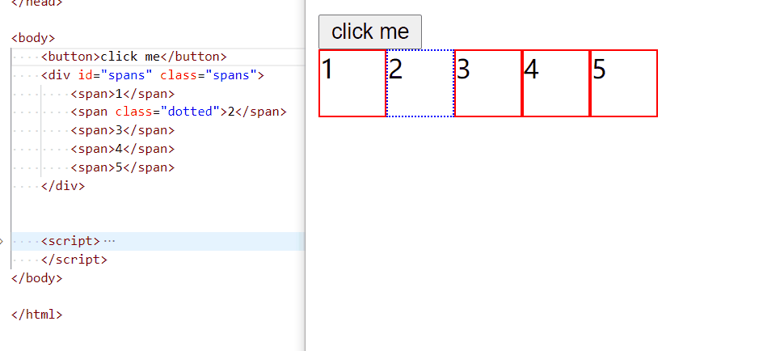

# 作为前端面试官的面试套路手册

由于最近大量面试人，总结了一套面试套路。个人认为或许能够选出 Lead 以下的人。

## HTML

- HTML 语义化
  我一般不会直接上来就问语义化这么明确的问题，我一般是让面试者，介绍最近实现的功能，然后引导出使用了什么标签？
  - 问题: 一般使用`div` 和 `span`就可以实现大部分功能，为什么 html 标准会有那么多标签？
- DOM 的基本操作
  - querySelector
    这里留个口子，引出 CSS 选择器。
  - createElement
  - appendChild / prepend
  - removeChild/ remove
    其实不是想问怎么操作 DOM，而是测试面试者是否知道，DOM 和 html markup 之间的关系。

> 你看看，作为面试官，明知道自己的问题不明确，需要别人再次确认，还是故意这样问。

> 但是，作为程序员，通过交流明确需求是一个技能。但是当别人答不上来，我会给引导，然后会明确需求的。

- 题目
  这个代码考验，怎么实现 dom 操作？
  [Code](./dom.html)
  

## CSS

- 选择器
  - Type/id/class/attribute
- 组合选择器
  - Selector list (span,div)
  - Descendant combinator (span div)
  - Child combinator (span > div)
  - General sibling combinator (span ~ div)
  - Adjacent sibling combinator (span + div)
    > 这里不是让面试者，背 css selector， 是通过问题和回答，让自己对面试者有个感觉。但是感觉这个东西就很神奇和诡异了。:(
- 伪类和伪元素
  - 什么是伪类，什么是伪元素?
    如果面试者没有答上来，
- 选择的权重

  - id > class/attribute/pseudo > type
  - 怎么看 !important，怎么 override。

- 布局 flexbox
  这里重点不是靠属性怎么写？而是看面试者有没有在全局上了解 flex。
- 布局 Grid
  我一般不问。
- ~~这里插入 BFC/IFC~~
  > 我没有想好怎么问这一类问题？ 我不想让面试者背定义，等我想好一个好的代码例子~~

### refer

[CSS_Selectors](https://developer.mozilla.org/en-US/docs/Web/CSS/CSS_Selectors)

## JavaScript

- ~~代码题目引入 JavaScript 问题~~

## Node.js

### 什么是 node.js？

这不是个问题，主要是为了把话题引到到 node.js。面试者怎么答都无关紧要，因为谁都答都不全面。

### Event Loop

我没有想好，怎么问这个问题，因此，面试者怎么答都可以。主要有个初步了解都可以。因为我会在最后用代码来验证，面试者的理解。

### node.js 是单线程的吗？

这才是真正的问题，取决于面试者如何回答，不过无论带是或者否，都会进入代码阶段。唯一区别，那个代码先问。

> ps: 虽然我没有想好，怎么面试 node.js 知识？但是我认为，下面几段代码，还是可以达到目的的。:)

### 代码 1

### 代码 2

### 代码 3

## CI CD

- 问面试者最近的一个 story 是怎么上线的?
  这里是想问，从本地开发，项目的 tool chain，PR， 怎么测试，怎么 deploy 的？
- 追问 git branch 策略？
- 然后在追问 CD 的细节。
- 怎么做 prod support 的？
  - 追问 log 是怎么记录？
  - 追问 log 的客户相关信息是怎么 mask 的?

## 问面试者还有什么问题吗？

一些不好回答与技术无关问题，甩锅给 HR。:)
