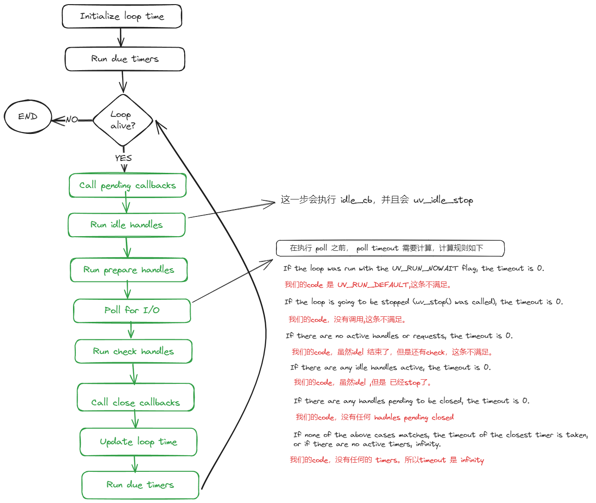

# Libuv loop iteration --- 为什么 event loop 不退出？

最近准备写个简单的 node.js。当然需要用到 libuv，然后在学习的过程中发现如下 code 没有按照我的预期运行。

## 问题
```c
#include <uv.h>
#include <stdio.h>

void check_cb(uv_check_t *handle)
{
    static int check_counter = 0;
    check_counter += 1;
    printf("Check callback #%d\n", check_counter);
    uv_check_stop(handle); 
}

void idle_cb(uv_idle_t *handle)
{
    static int idle_counter = 0;
    idle_counter += 1;
    printf("Idle callback #%d\n", idle_counter);
    uv_idle_stop(handle); 
}

int main()
{
    uv_loop_t *loop = uv_default_loop();
    uv_check_t check_handle;
    uv_idle_t idle_handle;

    // Initialize and start check handle
    uv_check_init(loop, &check_handle);
    uv_check_start(&check_handle, check_cb);
    // uv_unref((uv_handle_t*) &check_handle);

    // Initialize and start idle handle
    uv_idle_init(loop, &idle_handle);
    uv_idle_start(&idle_handle, idle_cb);

    printf("Starting event loop\n");
    uv_run(loop, UV_RUN_DEFAULT); // Run the event loop
    printf("Event loop stopped\n");

    uv_loop_close(loop); // Close the loop after it finishes
    return 0;
}
```

上面这段的输出是：
```shell
Starting event loop
Idle callback #1
```
`Check callback` 永远不会被调用。这让我无法理解。

求助于 ChatGPT O1, O1 的表现不尽人意。最后只能古法修行，细读文档加上些许 debug。对 event loop 也有了细致的理解。

## The I/O loop

下面这张图，在各种场合出现过。我根据官网的详细解释，对上述 code 的执行过程进行了标注。



当然 [文档]（https://docs.libuv.org/en/v1.x/design.html），还有更详细的解释。

### Poll for I/O

由于在 Poll for I/O 阶段需要计算 poll 的timeout 时间。 由于 idel 阶段已经结束。loop 只有check 阶段，并且 没有 timers。所以 poll 的 timeout 为 infinity。所以 poll 阶段会一直等待。check 阶段就无法被调用。于是 loop 就停留在第一次的 iteration。

> 其实在libuv code 中，timeout 是-1， 然后会传递给操作系统的epoll（linux）。Epoll 如果timeout 是 -1，会一直等待。

这就是上述code，一直等待的原因。

## reference

[Main loop deadlocks if only active handle is a uv_check_t](https://github.com/libuv/libuv/issues/2022)

[epoll_wait](https://man7.org/linux/man-pages/man2/epoll_wait.2.html)
> Specifying a timeout of -1 causes epoll_wait() to block indefinitely,

[libuv desgin](https://docs.libuv.org/en/v1.x/design.html)

