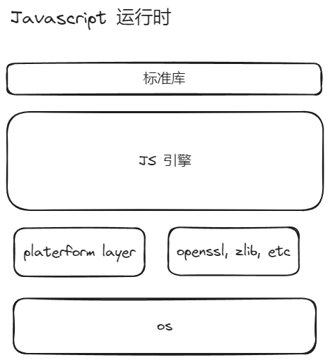

# 01- 从 0 写个微小的 Javascript 运行时 - 什么是 Javascript 运行时？

## 什么是 Javascript 运行时

对于 Nodejs 而言. 简单的可以理解为下面,

## 众多的 Javascript 运行时

现在市面上有很多 Javascript 运行时。下面是比较有名的几个。

### Node.js

- 基于 V8 引擎（Chrome 的 JavaScript 引擎）和 C++ 构建
- 主要用途：服务端和后端应用开发
- 特点：事件驱动、非阻塞 I/O、丰富的包生态系统（npm）

### Deno

- 基于 V8 和 Rust 构建
- 主要用途：安全且现代化的运行时，支持 ES 模块
- 特点：内置 TypeScript 支持，默认安全（沙箱机制）

### Bun

- 使用 Zig 和 JavaScriptCore（WebKit 引擎）构建
- 主要用途：高性能的一体化解决方案（打包工具、测试运行器等）
- 特点：快速启动、集成工具、兼容 Node.js

### Cloudflare Workers

- 基于 V8 引擎（隔离 Workers）和 C++ 构建
- 主要用途：边缘计算的无服务器环境
- 特点：极小的冷启动时间，为轻量级函数优化

### AWS LLRT

- 基于 Quickjs 引擎 和 Rust 构建
- 主要用途：边缘计算的无服务器环境
- 特点：极小的冷启动时间

这些 runtime 各自实现了自己的 std libary。虽然说生态蓬勃发展，但是也带来了一些问题。比如，不同的 runtime 之间的代码不可复用，不同的 runtime 之间的代码不可迁移。

## WinterTC (Technical Committee on Web-interoperable Server Runtimes)

WinterTC (TC55) 是 Ecma International 的一个技术委员会，旨在实现服务器端 JavaScript 运行时之间的 API 互操作性，特别是对于与 Web 共同的 API。

ECMA?? 相信熟悉 Javascript 都听过 [ECMAScript® Language Specification - TC39](https://tc39.es/ecma262/)。

WinterTC (TC55) 制定了很多 API，不同的 Javascript 运行都会实现这些 API。大家可以在他们官网去查看。[WinterTC work](https://wintercg.org/work)

这些 API 有很多是 web standrad 的 API，比如 `fetch`, `File`, `web stream` 等等。目前 nodejs 已经实现了很多 web API。

比如 Nodejs 关于stream 的 API 就有两个包 `node:stream`（Node.js 自己的 API） 和 `node:stream/web` [whatwg/streams](https://streams.spec.whatwg.org/)。

> 当然这也带来一些问题，让 nodejs API 变得更加复杂。

WinterTC 还有关于网络的 proposal， 比如 `Sockets API`. CLI API 等等。

> 你要是问为什么不直接使用 Node.js 的 API作为标准。那么请让我问一个问题，为什么 ES module(ES2015) 不直接使用 CommonJS 的模块规范？ES module 标准已经 10年了，但是我们如果看 JS 生态，大家还在日常开发中和这两种标准斗智斗勇。