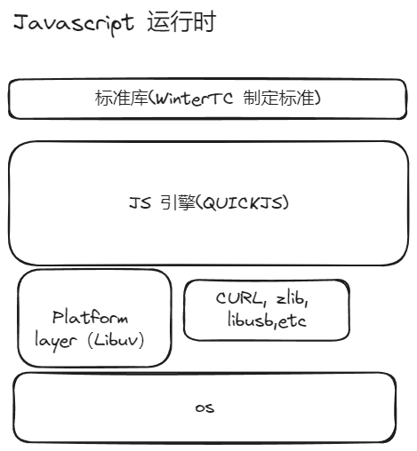

# 01- 从 0 写个微小的 Javascript 运行时 - 技术的选择

## 标准库

这个是个体力话，实现 [WinterTC](https://wintercg.org/work) 标准就好。

## JS 引擎--quickjs

我们必然需要一个 JS 引擎。这里选择 [quickjs](https://github.com/quickjs-ng/quickjs)。 

而不是大家熟悉的 V8。是因为 quickjs 更加轻量级，就一个 C 文件， 更容易理解和二次开发

> 我是不会承认我学不会 C++ 的。

## Platerform layer - Libuv

我们必然需要一个跨平台的异步 IO 库。这里选择 [libuv](https://libuv.org/)。 毕竟 nodejs 也是使用它，而且它还是C 写的，和quickjs 更般配。

## curl etc

我们还需要一些网络库，这里选择 [curl](https://curl.se/)。主要我们是做一个微小的 Javascript 运行时， 这里就不选择和 nodejs 一样在 libuv 的 TCP 基础上封装一层了。

技术选择完毕，下面就可以建立 repo 开工了。
