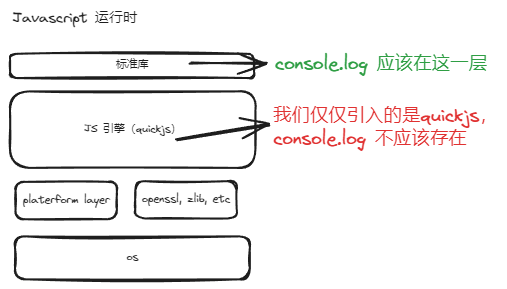

# 从 0 写个微小的 Javascript 运行时(04) - 添加一个自定义的模块/库

## 代码

https://github.com/zizifn/toy-js-runtime/tree/part2-add-custom-module

> 代码一般会按照一篇文章一个branch。这样方便大家查看。


## 从文件读取脚本

在上一篇文章中，我们已经可以执行简单的脚本了。但是这个脚本是写死在代码里面的。为了运行方便，让我们从文件读取js脚本。

代码和详细解释如下，为了简洁，我就不做异常处理了。

```c
int main(int argc, char** argv)
{
    .....
    uint8_t *script_str;
    size_t script_len;
    // 利用 C 语言的文件读取函数读取文件内容
    script_str = js_load_file(ctx, &script_len, filename);
    // 运行读取的 js 脚本
    ret = JS_Eval(ctx, script_str, script_len, filename, JS_EVAL_TYPE_MODULE);
    ......
}

```

### 运行 js 脚本
随便创建一个js文件，比如 `test.js`，内容如下：

```js
console.log(`hello world!! 1 + 2 = ${1+2}`);
```

```bash
mkdir build
cd build
cmake ..
make
./toyjsruntime ./src/test.js
``` 

如果你是使用 Clion，可以直接点击 `main.c`提示的运行按钮, 并配置相应的项目参数。

这样我们的 js runtime 就可以直接执行 js 文件了。

## Hello World 本地 C 模块



此时我们的 js runtime 基本上和 js 引擎的能力一样，除了能执行 js 脚本之外，什么也做不了。它现在什么模块都没有，比如nodejs 的 `fs` 模块，`http` 模块等等。

接下来，我们将实现一个简单的本地模块，这个模块可以返回机器的 memory 信息。

那么，我们应该怎么做呢？

1. 编写一个 C 函数，这个函数返回机器的 memory 信息
2. 创建一个模块，这个模块包含这个函数
3. 把这个模块注册到 js runtime 里面
4. 在 js 里面调用这个函数

### 编写模块

#### 获取机器内存信息

这里不同操作系统获取机器内存信息的方式不同，这里我们只实现 linux 下的获取内存信息。

https://github.com/zizifn/toy-js-runtime/blob/part1-add-custom-module/src/module_hello.c#L11

```c
// 我们只需要从 /proc/meminfo 文件读取信息就可以了，具体处理string的方式可以参考代码
FILE *file = fopen("/proc/meminfo", "r");
// MemTotal:        7036148 kB
// MemFree:         3082528 kB  
.....
```

#### 创建并且注册模块

https://github.com/zizifn/toy-js-runtime/blob/part1-add-custom-module/src/module_hello.c#L58

```c
static const JSCFunctionListEntry js_test_funcs[] = {
    JS_CFUNC_DEF("memory", 1, js_memory ),
};

static int js_test_init(JSContext *ctx, JSModuleDef *m){
    return JS_SetModuleExportList(ctx, m, js_test_funcs,
            countof(js_test_funcs));
}

JSModuleDef *js_init_module_test(JSContext *ctx, const char *module_name)
{
    JSModuleDef *m;
    // 创建一个模块，包含这个模块有多少方法或者变量
    m = JS_NewCModule(ctx, module_name, js_test_init);
    if (!m)
        return NULL;
    // 注册这个模块到 quickjs 的运行时。
    JS_AddModuleExportList(ctx, m, js_test_funcs, countof(js_test_funcs));
    return m;
}
```

这样我们就完成了，怎么把一个 C 函数映射到 js 里面。这就是在nodejs里面经常说的 `binding`。

#### 修改 main.c

```c
int main(int argc, char** argv)
{
    .....
    // 注册模块
    js_init_module_test(ctx, "toyjsruntime:test");
    .....
}
```

#### 在 js 里面调用这个模块

```js
import { memory } from 'toyjsruntime:test';
console.log(memory());
```