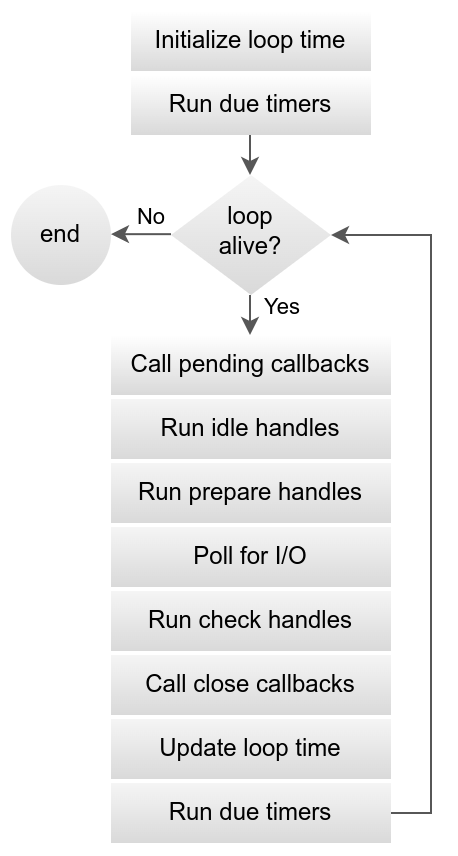

# 从 0 写个微小的 Javascript 运行时(05) - 添加 event loop （libuv）

## 代码

https://github.com/zizifn/toy-js-runtime/tree/part3-add-libuv

> 代码一般会按照一篇文章一个branch。这样方便大家查看。

## Event Loop （libuv）

至于 event loop 是什么，为什么要用 event loop， 我相信已经有很多文章介绍过了。这里我们直接使用 libuv 来实现 event loop。

下面是我自己写的关于 nodejs event loop 的文章。

### 文章链接

[为什么说 Node.js 不是完全的单线程？](https://zhuanlan.zhihu.com/p/463399842)

[Node.js 是怎么解决多任务问题的？](https://zhuanlan.zhihu.com/p/463538781)

### 官方网站

https://libuv.org/

## 把 libuv 加入到项目里面

这里和 quickjs 一样，使用Git Submodule 来管理 `libuv`。
    
```bash
git submodule add https://github.com/libuv/libuv.git deps/libuv
```
    
如果想使用某个版本的 `libuv`，可以切换到对应的 tag。

```bash
cd deps/libuv
git checkout tags/v1.5.0
```
可以使用 `git submodule update --init --recursive` 来初始化所有的 submodule，因为 submodule 也会有其他 submodule。

## 修改 CMakeLists.txt

和 quickjs 一样，我们需要修改 `CMakeLists.txt` 来添加 `libuv` 的编译选项。

```cmake
set(LIBUV_DIR ${CMAKE_SOURCE_DIR}/deps/libuv)
# Include libuv as a subdirectory
add_subdirectory(${LIBUV_DIR} ${CMAKE_BINARY_DIR}/libuv)
...
target_link_libraries(toyjsruntime PRIVATE m qjs uv)
```

## 添加 check 和 idle handler

下面是 libuv 的 event loop 的运行流程。


让我们来添加 check 和 idle handler 作为示例。

示例代码和注释如下。

```c
static void check_cb(uv_check_t *handle) {
    printf("check_cb------");
}

static void idle_cb(uv_idle_t *handle)
{
    printf("idle_cb------");
}

int main(int argc, char **argv)
{
        // 初始化 libuv 的 check 和 idle handle
    static uv_check_t check_handle;
    static uv_idle_t idle_handle;

    uv_check_init(uv_default_loop(), &check_handle);
    uv_check_start(&check_handle, check_cb);
    uv_unref((uv_handle_t *)&check_handle);

    uv_idle_init(uv_default_loop(), &idle_handle);
    uv_idle_start(&idle_handle, idle_cb);

    .......
    // 启动 event loop
    uv_run(uv_default_loop(), UV_RUN_DEFAULT);
}
```

这样 libuv 就成功的加入到项目里面了，下面让我们了build ，运行看看效果吧。

oh..... **idle_cb 方法一直在运行**.但是为什么呢？因为 idle handler 没有stop，所以event loop 一直在运行。

这里需要一种机制来停止 idle handler，这样 event loop 才会停止。

方法就是，在 check handler 里面检测如果没有任何 promise 就停止 idle handler，然后退出 event loop 程序结束。

> 如果对于libuv 的 event loop 不熟悉，可以细细读读文档 https://docs.libuv.org/en/v1.x/design.html

## 修改 check_cb
    
```c
static void check_cb(uv_check_t *handle)
{
    JSContext *ctx1;
    int err;
    JSRuntime *rt = handle->data;
    while (1)
    {
        // 这里一直执行 JS_ExecutePendingJob 执行 promise
        err = JS_ExecutePendingJob(rt, &ctx1);
        if (err <= 0)
        {
            // if err < 0, an exception occurred
            break;
        }
    }
    .....
    //如果没有任何 promise 就停止 idle handler
    uv_idle_stop(idle_handler);// ？？？
    .....
}
```

但是又有个问题，但是在`check_cb`里面，我们怎么知道有哪些 idle handler 呢？

en... 我们可以把 `idle handler` 放在全局变量中。
但是为了维护性，可以利用 JSRuntime 一个预留的字段 `user_opaque`，我们可以把自己的数据结构放在里面。

``` c
struct JSRuntime {
......
void *user_opaque;
.....
};
```

## 添加自定义数据到 JSRuntime
```c
typedef struct JSRuntimeAddinfo
{
    // 这里存放quickjs 自定义的链表
    struct list_head idle_handlers;
} JSRuntimeAddinfo;


int main(int argc, char **argv)
{
    .........
    rt = JS_NewRuntime();
    JSRuntimeAddinfo *customData = js_mallocz_rt(rt, sizeof(JSRuntimeAddinfo));
    init_list_head(&customData->idle_handlers);
    
    // 使用这个可以把 user_opaque 指向自己的数据结构。
    JS_SetRuntimeOpaque(rt, customData);
    ........

    JSIdleHandler *idle_handler = js_mallocz_rt(rt, sizeof(JSIdleHandler));
    uv_idle_init(uv_default_loop(), &idle_handler->idle_handle);
    uv_idle_start(&idle_handler->idle_handle, idle_cb);
    
    // 这里我们把 idle handler 加入到链表里面
    list_add_tail(&idle_handler->link, &customData->idle_handlers);
}
```

这样我们就把 `idle_handler` 加入到链表里面了。 并且可以通过 `JS_GetRuntimeOpaque` 来获取到链表。

## 重新修改 check_cb

```c
static void check_cb(uv_check_t *handle)
{
    JSContext *ctx1;
    int err;
    JSRuntime *rt = handle->data;
    while (1)
    {
        err = JS_ExecutePendingJob(rt, &ctx1);
        if (err <= 0)
        {
            // if err < 0, an exception occurred
            break;
        }
    }

    JSRuntimeAddinfo *customData = JS_GetRuntimeOpaque(rt);
    struct list_head *el;
    JSIdleHandler *idle_handler;
    // 这里我们遍历链表，找到 idle handler
    list_for_each(el, &customData->idle_handlers)
    {
        idle_handler = list_entry(el, JSIdleHandler, link);
    }
    // 如果找到，就停止 idle handler
    if (idle_handler != NULL)
    {
        uv_idle_stop(&idle_handler->idle_handle);
        list_del(&idle_handler->link);
        js_free_rt(rt, idle_handler);
    }
}
```

这样我们会在 check handler 里面停止 idle handler。这里 event loop 就会停止。

校验程序是否运行正常。

```bash
mkdir build
cd build
cmake ..
make
./toyjsruntime ./src/test.js
``` 

结果如下：

```bash
7036148
idle_cb------
check_cb11122------
```