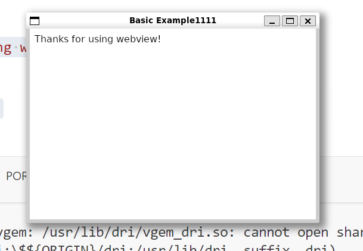
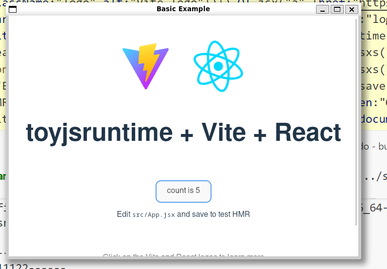

# 从 0 写个微小的 Javascript 运行时(08) - 克隆一个 electron 跨平台框架


## 代码

https://github.com/zizifn/toy-js-runtime/tree/part6-webview-electron

> 代码一般会按照一篇文章一个branch。这样方便大家查看。

## electron

Electron 是一个使用 JavaScript、HTML 和 CSS 构建桌面应用程序的框架。
大名鼎鼎，感觉桌面应用都在用它。它正在吞噬整个桌面应用市场。

Electron 核心就是 Chromium 和 Node.js。

> 当然它也有缺点，体积大，内存占用高。

下面是一个最简单的 electron hello world 例子。

``` JavaScript
const { app, BrowserWindow } = require('electron')

const createWindow = () => {
  const win = new BrowserWindow({
    width: 800,
    height: 600
  })

  win.loadFile('index.html')
}

app.whenReady().then(() => {
  createWindow()
})
```

下面我们就在 toyjsruntime 里面实现一个类似的框架。

## 技术选择

由于 Chromium C 使用起来太复杂了，我还没有来得及研究。这里我们选择了一个轻量级的 [webview](https://github.com/webview/webview) 作为 UI 的实现。

> Chromium 虽然大，占用内存。但是它把跨平台的复杂度隐藏了。
> Google 以及其他厂商的工程师们花了大量的时间来维护它。我们只需要使用就好了。

### webview 

webview 是一个轻量级的跨平台 WebView 库，使用 C/C++ 语言编写。它允许开发者在桌面应用程序中嵌入 Web 内容，并提供了与 JavaScript 的交互接口。

由于它在不同平台使用不同内核，所以 webview 体积非常小，但是大家需要在不同平台安装对应的库。

Platform | Technologies
-------- | ------------
Linux    | [GTK][gtk], [WebKitGTK][webkitgtk]
macOS    | Cocoa, [WebKit][webkit]
Windows  | [Windows API][win32-api], [WebView2][ms-webview2]

首先我们把依赖安装到自己开发机器上。

如下是 Debian/Ubuntu 的安装命令。其他平台请查看 [webview 文档](https://github.com/webview/webview?tab=readme-ov-file#packages)
``` bash
apt install libgtk-4-dev libwebkitgtk-6.0-dev
apt install libgtk-4-1 libwebkitgtk-6.0-4
```


webview 的库`libwebviewd.so.0.12.0`我已经 build 好了。大家直接 clone 我的项目就可以了。

https://github.com/zizifn/toy-js-runtime/tree/part6-webview-electron/src/example/webview


## quickjs + webview Hello world

下面是 webview 的 hello world 例子 C 代码。
``` c
#include "webview/webview.h"
#include <stddef.h>
int main(void) {

  webview_t w = webview_create(0, NULL);
  webview_set_title(w, "Basic Example");
  webview_set_size(w, 480, 320, WEBVIEW_HINT_NONE);
  webview_set_html(w, "Thanks for using webview!");
  webview_run(w);
  webview_destroy(w);
  return 0;
}
```

我们需要使用 [quickjs -ffi](https://zhuanlan.zhihu.com/p/25460403113) 来把 C 函数转成 js 函数。这样我们就可以在 js 里面调用C 函数了。

详细代码见 [webview.js](https://github.com/zizifn/toy-js-runtime/blob/part6-webview-electron/src/example/webview/webview.js) (https://github.com/zizifn/toy-js-runtime/blob/part6-webview-electron/src/example/webview/webview.js）

如果大家有兴趣，可以看看 [webview 的 C 接口](https://github.com/webview/webview/blob/master/core/include/webview/api.h) 的文档。

``` javascript
import { CCallback } from 'toyjsruntime:jsffi';
import * as ffi from 'toyjsruntime:ffi';

const webviewLib = './libwebviewd.so.0.12.0';

//WEBVIEW_API webview_t webview_create(int debug, void *window);
const webview_create = new CFunction(webviewLib, 'webview_create', null, 'pointer', 'int', 'pointer').invoke;

//webview_error_t webview_set_title(webview_t w, const char *title);
const webview_set_title = new CFunction(webviewLib, 'webview_set_title', null, 'int', 'pointer', 'string').invoke;

//webview_error_t webview_set_size(webview_t w, int width, int height,webview_hint_t hints);
const webview_set_size = new CFunction(webviewLib, 'webview_set_size', null, 'int', 'pointer', 'int', 'int', 'int').invoke;

//webview_error_t webview_set_html(webview_t w, const char *html);
const webview_set_html = new CFunction(webviewLib, 'webview_set_html', null, 'int', 'pointer', 'string').invoke;

```

然后就可以在 js 里面调用了 webview 的接口了。

``` javascript

const w = webview_create(1, ffi.NULL); // Changed debug parameter to 1
webview_set_title(w, "Basic Example1111");
webview_set_size(w, 480, 320, 0);
webview_set_html(w, `Thanks for using webview!`);
webview_run(w);
webview_destroy(w);
```

然后就可以直接运行了。
``` bash
 sudo ./toyjsruntime ../src/example/webview/webview.js
```
>如果遇到库 libwebviewd 找不到，请运行下 cmake 或者直接copy 到 build 目录下。如果其他库找到不到，请查看 webview 官方文档，安装相应的依赖。

> 如果遇到权限问题，请使用 sudo 运行。

下面是我在 WSL2 debian 下的运行截图。



## 优化下接口

上面代码有点繁琐。我们些许封装下，更方便使用。详细代码见 [webview.js](https://github.com/zizifn/toy-js-runtime/blob/part6-webview-electron/src/example/webview/webview.js) (https://github.com/zizifn/toy-js-runtime/blob/part6-webview-electron/src/example/webview/webview.js）

> 这里我利用libuv 封装了一个读取文件的模块，具体代码见 [module_fs](https://github.com/zizifn/toy-js-runtime/blob/part6-webview-electron/src/module_fs.c)

``` javascript
import { CFunction, CCallback } from 'toyjsruntime:jsffi';
import { readFile } from 'toyjsruntime:fs';
import * as ffi from 'toyjsruntime:ffi';
const webviewLib = './libwebviewd.so.0.12.0';
//WEBVIEW_API webview_t webview_create(int debug, void *window);
const webview_create = new CFunction(webviewLib, 'webview_create', null, 'pointer', 'int', 'pointer').invoke;

....
class BrowserWindow {
    constructor({
        width = 480,
        height = 320,
    } = {}) {
        this.w = webview_create(1, ffi.NULL);
        webview_set_size(this.w, width, height, 0);
        webview_set_title(this.w, "Basic Example");
    }

    async loadFile(file) {
        const html = await readFile(file);
        webview_set_html(this.w, html);
        console.log("after webview_set_html")
        webview_run(this.w); // 应该跑在 thread 里面，不 block 主线程
        webview_destroy(this.w);
    }
}

const window = new BrowserWindow(
);
await window.loadFile('index.html'); // 这里我们可以传入html 文件。

```

这里我准备了一个 react counter 的 例子。然后利用 vite 来打包成一个html 文件。
运行效果如下。



> 这是一个很粗糙的实现，只是为了演示下思路。后续如果有时间，我会继续完善。
