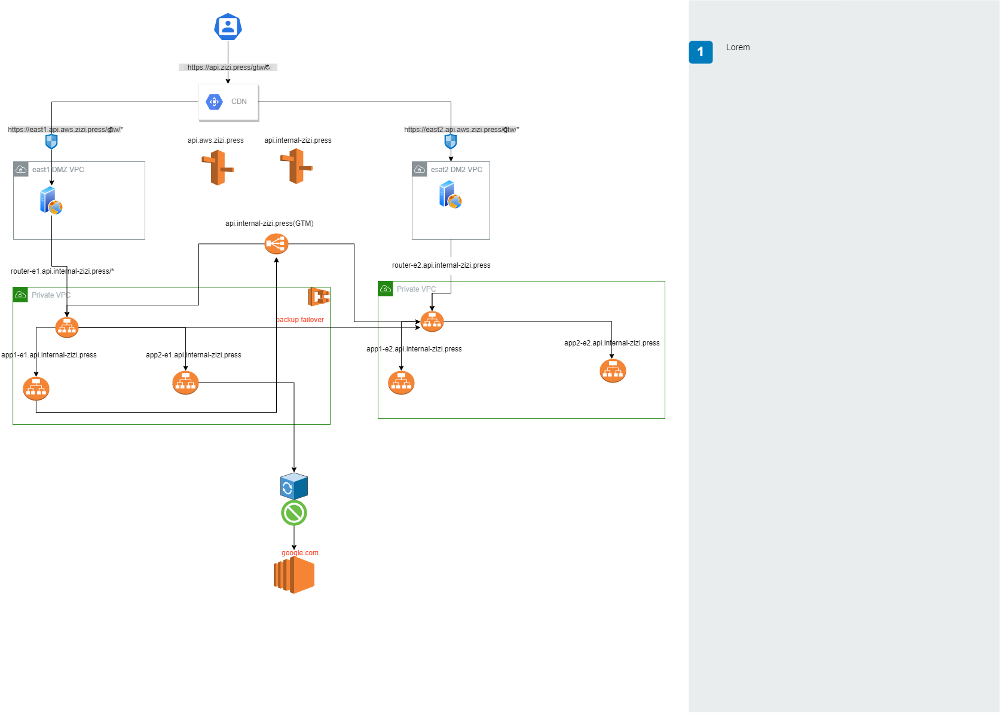

# 微服务的技术架构

以下是我们实际工作中微服务和 BFF 前端服务集群的架构图，其中省略了很多细节和敏感信息。相关 URL 都使用了我自己的域名。

这套架构服务从一开始在自己数据中心，然后也同样应用到了基于 AWS ECS。

未来的演化，可以升级到 K8S，然后优化路由部分和服务直接调用部分。或者使用 service mesh。

## 架构图

## 域名和 CDN 策略

### 共有域名

### 私有域名

### CDN

## 网络隔离

### VPC 划分

### DMZ VPC

### APP VPC

## APP 之间的通信

### APP 路由策略

### Proxy

## failover 策略

### Top level failover

### App level failover

## 监控

### 服务的监控

### 如何确保业务部门 APP 可控

基于 docker 仓库以及 image tag 进行如下管理，

1. 静态代码扫描
2. 性能测试通过
3. 上线前的 ticket
4. 自动通过可控工具部署到生产环境
   - 检测 image 是否具体上线条件，可控，可回查

### 如何服务业务部门？

#### 如何规范业务 app 的申请，上线，测试流程?

#### 如何支持不同框架？

#### 模板化 CICD

#### 怎么做蓝绿部署？

#### 全链路 HTTPS

##### APP https key store 和 trust store 的管理
