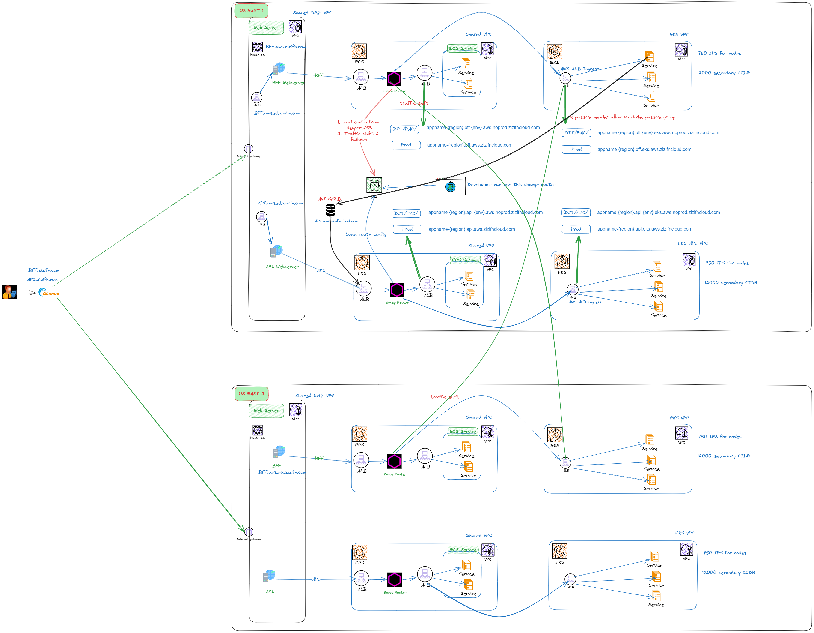
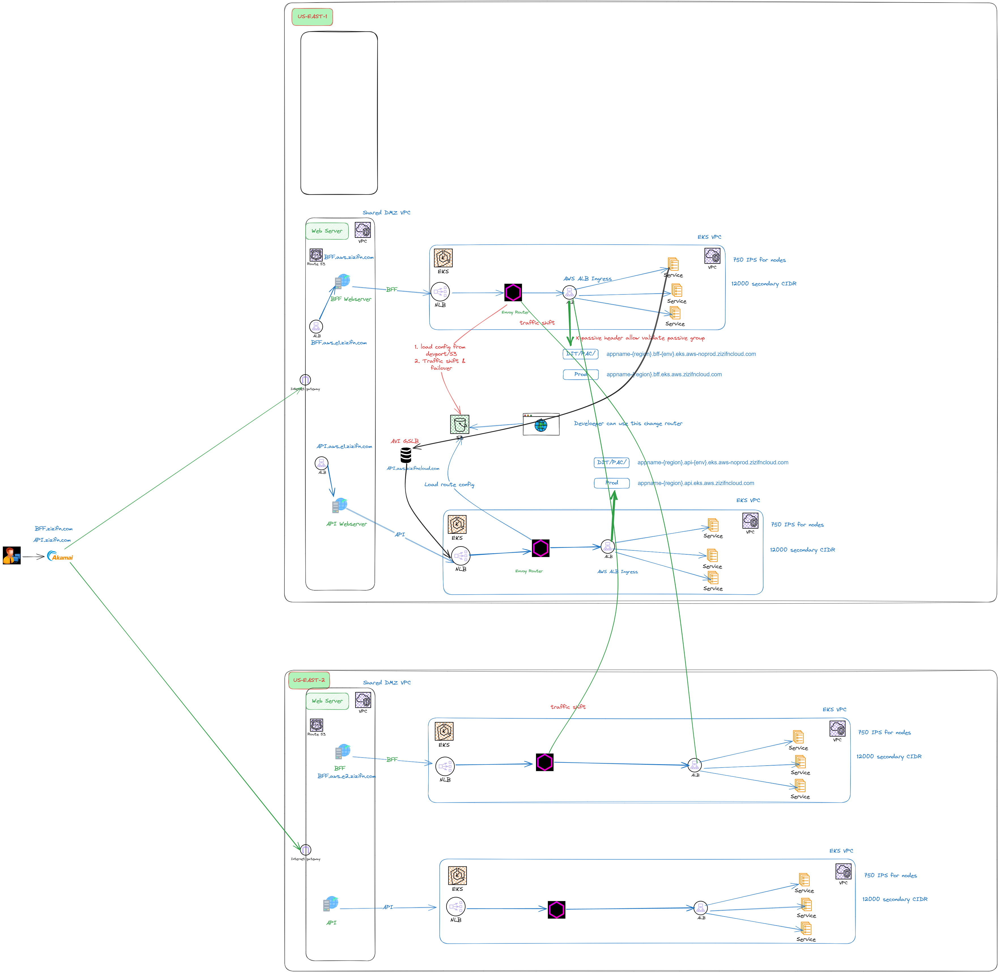

# 微服务的技术架构

以下是我们实际工作中微服务和 BFF 前端服务集群的架构图，其中省略了很多细节和敏感信息。相关 URL 都使用了我自己的域名。

这套架构服务从一开始在自己数据中心，然后也同样应用到了基于 AWS ECS。

未来的演化，可以升级到 K8S，然后优化路由部分和服务直接调用部分。或者使用 service mesh。

一个基本完备的 基于 kubernetes 实现的POC。 https://github.com/zizifn/k8s-poc

## 架构图

### 旧版本

### 架构演进版本

#### Why

1. ECS 的服务现在基本都到了EKS。为了简化架构，把 router 迁移到 EKS
2. NLB 比 ALB 性能更好。

## 域名和 CDN 策略

### 共有域名

### 私有域名

### CDN

#### 静态CDN 

静态域名，DDOS, 回源减少。

Cache-Control/expires
ETag/If-None-Match
Last-Modified/If-Modified-Since

#### 动态 CDN

1. TCP 优化
2. Route 优化
3. 回源长连接，降低源的压力
4. 多种路由策略
   - Stickiness cookies
   - etc
4. SSL offload(不推荐)

#### Envoy Router

CDN 已经根据 Stickiness cookies做了初略的路由。 

Router 让我们有更细粒度的流量控制，从而做到 failover 和更细粒度的多活策略。

1. 可以自定义路由测试策略。 更具 header 或者cookies 

#### 多活

常见的数据多活策略有：

1. 分布式数据库

   比如 OceanBase 和 TiDB. 通过增加延迟，确保数据写入多个副本才算成功。这样如果一个region 挂了，可以快速切换到另一个 region。

2. 读写分离。

会出现cache不一致的问题。
- 读的zone，如果需要写， 在 cache 设置一个marker。
- Then 写入主 DB。
- 如果 marker set, then 读取主库。else，读取从库。
- 如果从库同步过来，清除 marker。

#### CDN bypass when CDN is down
TODO

## 网络隔离

### 需要公司基础架构中支持

https://github.com/sergiomarotco/Network-segmentation-cheat-sheet

### VPC 划分

### DMZ VPC

### APP VPC

### DataCenter connetcivity

1. 所有应用均可通过AWS Direct Connect连接到数据中心。
2. 默认情况下，防火墙会阻止所有流量，需提交工单以开启。

###  Internet connectivity

所有请求必须通过具有白名单规则的HTTP/Socket代理。

### BU Cross Account connectivity

1. VPC peering
2. Transit Gateway

### Across BU Cross Account connectivity

1. Gateway
2. privatelink

## APP 之间的通信

### Server side discovery

ALB with ingress controller for server side discovery.

#### Why not client side discovery

1. 架构的延续性

这一套架构从之前之际的data center 都没有改变。 之前LB 用的是 F5 LTM。
其次，还有 Enovy Router 的原因，之前是部署在 ECS，无法跨 EKS 和 ECS cluster。

### Envoy Router

所有 APP 直接通信都是通过 envoy router 完成。Envoy Router 做 cross cluster 的路由。

虽然这样集中路由，会照成 router 很热。或许未来可以用 service mesh 来解决。

## Resiliency & Observability

### Resiliency Pattens 
1. Circuit Breaker

#### failover

### Observability
1. Logging

  统一的log log。 使用 Splunk Cloud 作为 log 收集和查询工具。

2. Metrics

每个 ecs 和 EKS node 都会安装 Datadog agent，用于收集系统和应用的 metrics。

3. Tracing

每个 ecs 和 EKS node 都会安装 Datadog agent，用于收集系统和应用的 metrics。

#### Splunk and Datadog Dashboard

## Health check
https://kubernetes.io/zh-cn/docs/concepts/configuration/liveness-readiness-startup-probes/

1. Liveness probe 
2. Readiness probe
3. APP 会响应 sigetm 信号，然后退出。

### Top level failover

CDN 会进行 failover。

### App level failover

完全由 Enovy Router + APP ALB 完成。

### 如何确保业务部门 APP 可控

基于 docker 仓库以及 image tag 进行如下管理，

1. 静态代码扫描
2. 性能测试通过
3. 上线前的 ticket
4. 自动通过可控工具部署到生产环境
   - 检测 image 是否具体上线条件，可控，可回查

### 如何服务业务部门？

#### 如何规范业务 app 的申请，上线，测试流程?

#### 如何支持不同框架？

#### 模板化 CICD

#### 怎么做蓝绿部署？

#### 怎么确保多租户

#### 全链路 HTTPS

##### APP https key store 和 trust store 的管理
